# Projeto Banco — API

## 1. Alunos e RMs

| Nome completo | RM |
|---|---|
| Isabelle Dallabeneta Carlesso | RM554592 |
| Nicoli Amy Kassa | RM559104 |


---

## 2. Produto bancário escolhido

**Produto:** Empréstimo (`Emprestimo`)

**Justificativa:** O produto de empréstimo foi escolhido por permitir a implementação de uma regra de negócio clara e objetiva: a análise e aprovação do crédito com base no valor solicitado pelo cliente. Isso viabiliza a demonstração completa do fluxo de contratação — desde o cadastro do cliente até a aprovação ou recusa — de forma síncrona e rastreável, sem depender de integrações externas complexas.

---

## 3. Diagrama de classes


---

## 4. Como rodar localmente

### Pré-requisitos

- [.NET 8 SDK](https://dotnet.microsoft.com/download/dotnet/8)
- Acesso à rede da FIAP (VPN ou rede interna) para o banco Oracle
- Credenciais Oracle individuais (RM + senha)

### Configurar a connection string

Edite o arquivo `appsettings.json` na raiz do projeto:

```json
"ConnectionStrings": {
    "OracleConnection": "User Id=RMXXXXXX;Password=DDMMAA;Data Source=oracle.fiap.com.br:1521/ORCL"
  }
```

### Aplicar as migrations

```bash
dotnet ef database update
```

### Rodar a API

```bash
dotnet run
```

A API estará disponível em `https://localhost:{porta}/swagger`.

---

## 5. Endpoints disponíveis

### POST `/api/agencias` — Cadastrar agência

**Request:**
```json
{
  "nome": "Agência Central",
  "cidade": "São Paulo"
}
```

**Response `201 Created`:**
```json
{
  "id": 1,
  "nome": "Agência Central"
}
```

---

### GET `/api/agencias/{id}` — Buscar agência

**Response `200 OK`:**
```json
{
  "id": 1,
  "nome": "Agência Central"
}
```

**Response `404 Not Found`:**
```json
"Agência não encontrada."
```

---

### POST `/api/clientes/pf` — Cadastrar pessoa física

**Request:**
```json
{
  "nome": "João Silva",
  "cpf": "123.456.789-00",
  "dataNascimento": "1990-05-15",
  "agenciaId": 1
}
```

**Response `201 Created`:**
```json
{
  "cpf": "123.456.789-00",
  "dataNascimento": "1990-05-15T00:00:00",
  "id": 1,
  "nome": "João Silva",
  "agenciaId": 1,
  "agencia": {
    "id": 1,
    "nome": "Agência Central"
  }
}
```

**Response `400 Bad Request` (CPF duplicado):**
```json
"CPF já cadastrado."
```

**Response `404 Not Found` (agência inexistente):**
```json
"Agência não encontrada."
```

---

### POST `/api/clientes/pj` — Cadastrar pessoa jurídica

**Request:**
```json
{
  "nome": "Empresa XYZ",
  "cnpj": "12.345.678/0001-99",
  "razaoSocial": "Empresa XYZ Ltda",
  "agenciaId": 1
}
```

**Response `201 Created`:**
```json
{
  "cnpj": "12.345.678/0001-99",
  "razaoSocial": "Empresa XYZ Ltda",
  "id": 4,
  "nome": "Empresa XYZ",
  "agenciaId": 1,
  "agencia": {
    "id": 1,
    "nome": "Agência Central"
  }
}
```

**Response `400 Bad Request` (CNPJ duplicado):**
```json
"CNPJ já cadastrado."
```

---

### GET `/api/clientes/{id}` — Buscar cliente por ID

**Response `200 OK`:**
```json
{
    "id": 1,
    "nome": "João Silva",
    "agenciaId": 1,
}
```

**Response `404 Not Found`:**
```json
"Cliente não encontrado."
```

---

### POST `/api/contratacoes` — Solicitar contratação

**Request:**
```json
{
  "clienteId": 1,
  "produto": "Emprestimo",
  "valorSolicitado": 5000.00
}
```

**Response `202 Accepted`:**
```json
{
  "mensagem": "Contratação recebida e em processamento",
  "id": 1,
  "status": "PENDENTE"
}
```

**Response `404 Not Found` (cliente inexistente):**
```json
"Cliente não encontrado."
```

**Regra de negócio:** Empréstimos com `valorSolicitado` acima de R$ 10.000,00 são automaticamente recusados. Valores iguais ou inferiores são aprovados.

---

### GET `/api/contratacoes/{id}` — Consultar status da contratação

**Response `200 OK`:**
```json
{
  "id": 1,
  "clienteId": 1,
  "valorSolicitado": 5000,
  "status": "APROVADO"
}
```

**Response `404 Not Found`:**
```json
"Contratação não encontrada."
```
 

---

## 6. POSTs e GETs

#### POST agencias

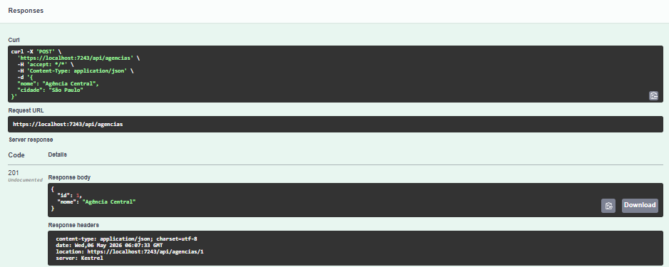

#### GET agencias

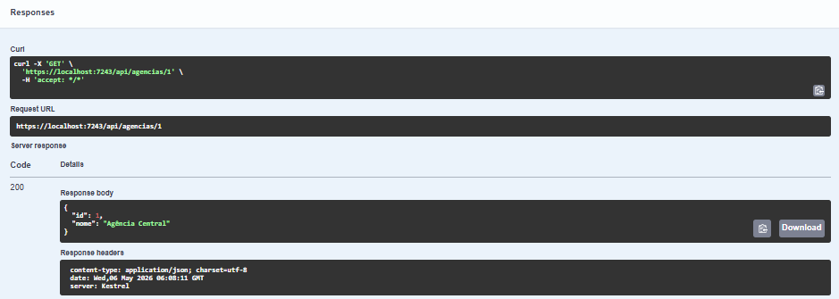


#### POST clientes PF

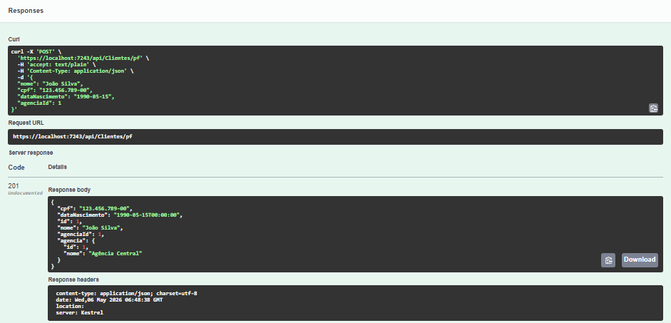

#### POST clientes PJ


#### GET clientes 

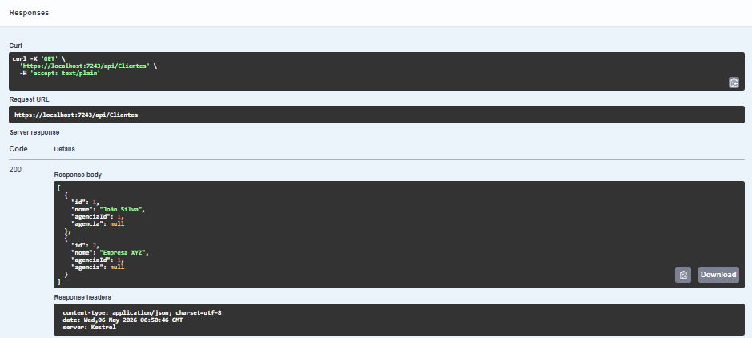

#### POST contratacoes

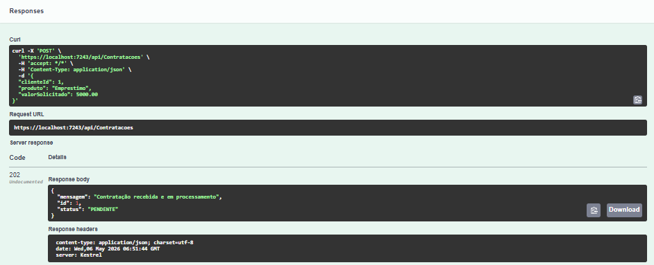

#### GET contratacoes

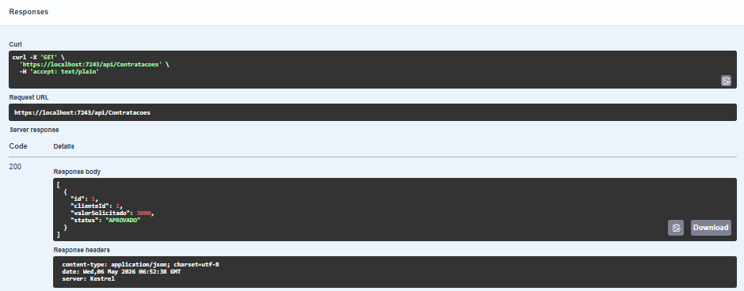

#### GET ID contratacoes

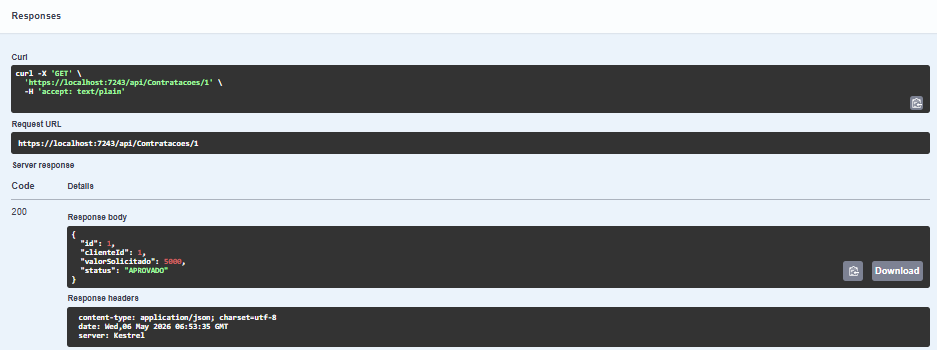


---

## 7. Testes de erros

#### Cadastro de PF com CPF duplicado → `400`

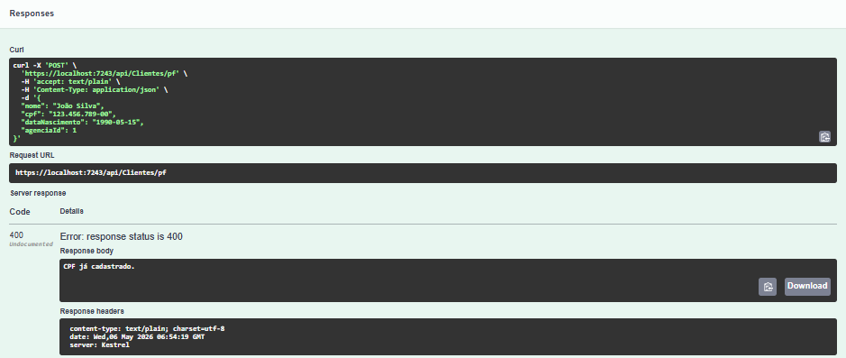


#### Cadastro de PJ com CNPJ duplicado → `400`

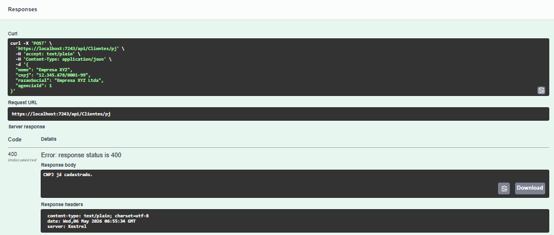


#### Vincular cliente a agência inexistente → `404`

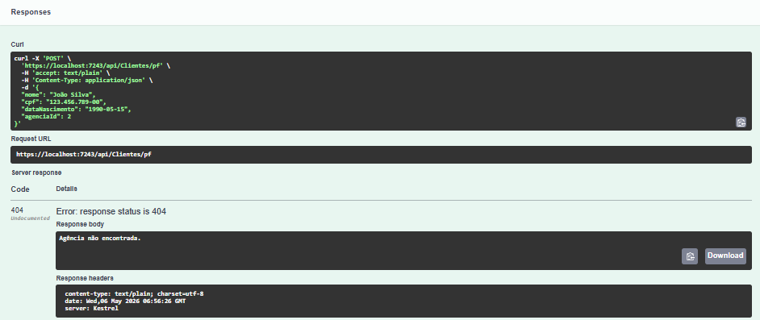


#### Contratação para cliente inexistente → `404`

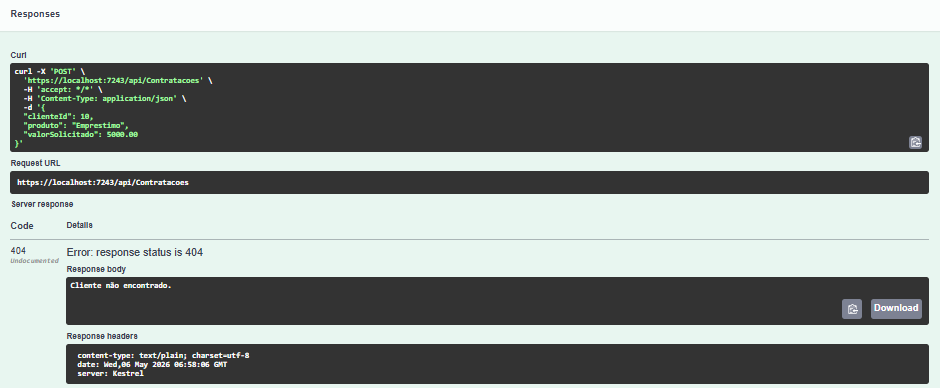


#### Consulta de status após processamento → `200`
 
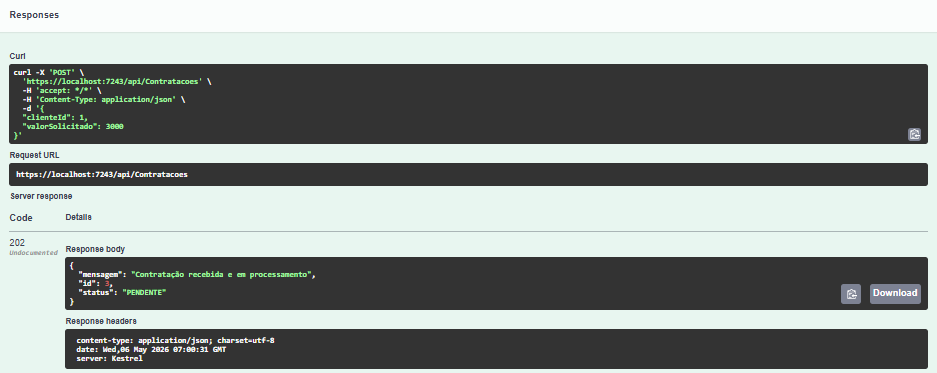
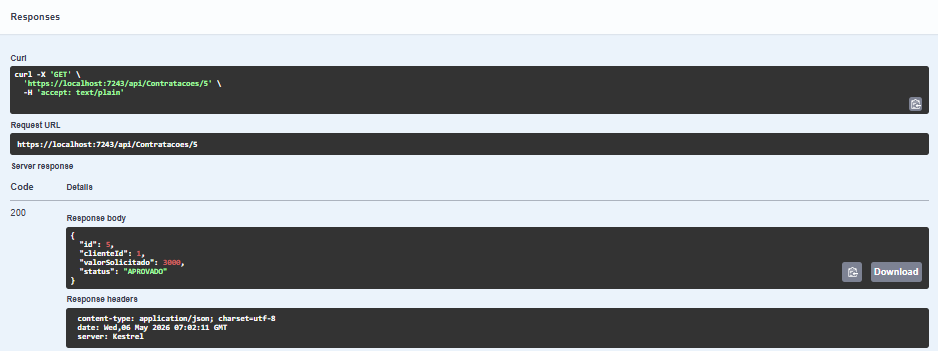

---

## 8. API no Swagger  

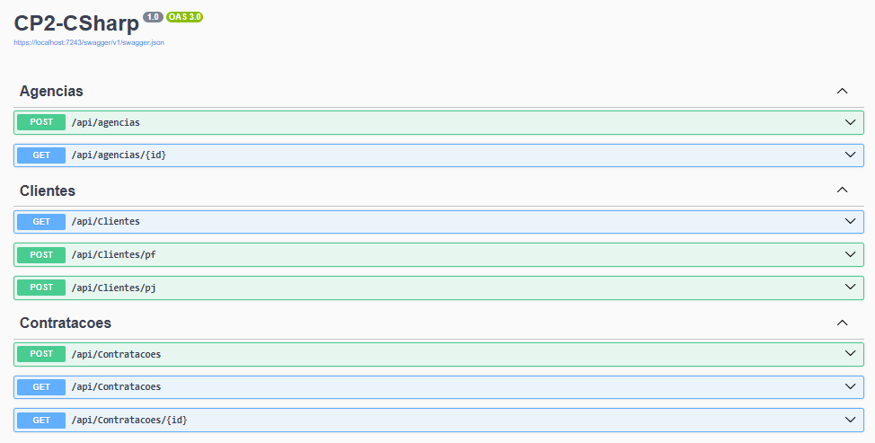
